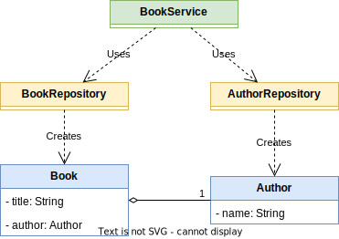

# Wiring beans in the configuration file

> This project is based on chapter **3.1. Implementing relationships among beans defined in the configuration file** from book **Spring Starts here (2021)** by Laurentiu Spilca.

## Class diagram



## Create Maven project with Intellij Idea

File > New project > Java

## Add Spring Context dependency

```xml
<dependency>
    <groupId>org.springframework</groupId>
    <artifactId>spring-context</artifactId>
    <version>6.1.10</version>
</dependency>
```

## Create entities

```java
public class Book {
    private final String title;
    private final Author author;

    public Book(String title, Author author) {
        this.title = title;
        this.author = author;
    }

    public String getTitle() {
        return title;
    }

    public Author getAuthor() {
        return author;
    }

    @Override
    public boolean equals(Object obj) {
        if (this == obj) {
            return true;
        }
        if (obj == null || getClass() != obj.getClass()) {
            return false;
        }
        Book book = (Book) obj;
        return title.equals(book.title) && author.equals(book.author);
    }

    @Override
    public int hashCode() {
        return title.hashCode() + author.hashCode();
    }
}
```

```java
public class Author {
    private String name;

    public Author(String name) {
        this.name = name;
    }

    public String getName() {
        return name;
    }

    @Override
    public boolean equals(Object obj) {
        if (this == obj) {
            return true;
        }
        if (obj == null || getClass() != obj.getClass()) {
            return false;
        }
        Author author = (Author) obj;
        return name.equals(author.name);
    }

    @Override
    public int hashCode() {
        return name.hashCode();
    }
}
```

## Create repositories

```java
public class AuthorRepository {
    public Author getAuthor() {
        return new Author("F. Scott Fitzgerald");
    }
}
```

```java
public class BookRepository {
    public Book getBook(Author author) {
        return new Book("The Great Gatsby", author);
    }
}
```

## Create service

```java
public class BookService {
    private final BookRepository bookRepository;
    private final AuthorRepository authorRepository;

    public BookService(BookRepository bookRepository, AuthorRepository authorRepository) {
        this.bookRepository = bookRepository;
        this.authorRepository = authorRepository;
    }

    public Book getBook() {
        final Author author = authorRepository.getAuthor();
        return bookRepository.getBook(author);
    }
}
```

## Create configuration class

- `BookRepository` is wired to `BookService` using `bookRepository()` method call
- `AuthorRepository` is wired to `BookService` using `authorRepository` parameter

```java
@Configuration
public class ApplicationConfiguration {
    @Bean
    public BookRepository bookRepository() {
        return new BookRepository();
    }

    @Bean
    public AuthorRepository authorRepository() {
        return new AuthorRepository();
    }

    @Bean
    public BookService bookService(AuthorRepository authorRepository) {
        return new BookService(bookRepository(), authorRepository);
    }
}
```

## Create Spring context

```java
ApplicationContext context = new AnnotationConfigApplicationContext(ApplicationConfiguration.class);
```

## Get bean from Spring context

```java
Book book = context.getBean(BookService.class).getBook();
System.out.println("The book is: " + book.getTitle() + " by " + book.getAuthor().getName());
```

# Create Tests

## Create unit tests for repositories

- `AuthorRepository`
- `BookRepository`

### Add dependency for JUnit

```xml
<dependency>
    <groupId>org.junit.jupiter</groupId>
    <artifactId>junit-jupiter-engine</artifactId>
    <version>5.11.0-M2</version>
    <scope>test</scope>
</dependency>
```

### Create test

- use annotations `@Test` and `@DisplayName` to mark test methods
- use `assertEquals` method to compare expected and actual values

```java
class AuthorRepositoryTest {

    @Test
    @DisplayName("Fetches the author")
    void getAuthor() {
        AuthorRepository authorRepository = new AuthorRepository();

        Author actual = authorRepository.getAuthor();
        Author expected = new Author("F. Scott Fitzgerald");

        assertEquals(expected, actual);
    }
}
```

## Create unit test for service with mocked repositories

### Add dependency for Mockito framework

- allows creating mock objects

```xml
<dependency>
    <groupId>org.mockito</groupId>
    <artifactId>mockito-core</artifactId>
    <version>5.12.0</version>
    <scope>test</scope>
</dependency>
```

### Add dependency for Mockito JUnit 5 support

- allows to initialize mocks in JUnit 5 tests

```xml
<dependency>
    <groupId>org.mockito</groupId>
    <artifactId>mockito-junit-jupiter</artifactId>
    <version>5.12.0</version>
    <scope>test</scope>
</dependency>
```

### Create test

- use `@ExtendWith(MockitoExtension.class)` annotation to add Mockito JUnit 5 support
- use `@Mock` annotation to mark fields that should be mocked

```java
@ExtendWith(MockitoExtension.class)
class BookServiceTest {
    @Mock
    private BookRepository bookRepository;

    @Mock
    private AuthorRepository authorRepository;

    @Test
    @DisplayName("Combines the author and book to get the book")
    void getBook() {
        given(authorRepository.getAuthor()).willReturn(new Author("author"));
        given(bookRepository.getBook(new Author("author"))).willReturn(new Book("book", new Author("author")));

        BookService bookService = new BookService(bookRepository, authorRepository);

        Book actual = bookService.getBook();
        Book expected = new Book("book", new Author("author"));

        assertEquals(expected, actual);
    }
}
```

## Create integration test

### Add dependency for Spring TestContext Framework

Spring TestContext Framework provides support for loading Spring ApplicationContext and beans in tests.

```xml
<dependency>
    <groupId>org.springframework</groupId>
    <artifactId>spring-test</artifactId>
    <version>6.1.10</version>
    <scope>test</scope>
</dependency>
```

### Create test

- use `@ExtendWith(SpringExtension.class)` annotation to add Spring TestContext Framework support
- use `@ContextConfiguration` annotation to specify the configuration class

```java
@ExtendWith(SpringExtension.class)
@ContextConfiguration(classes = ApplicationConfiguration.class)
public class IntegrationTest {
    @Autowired
    private BookService bookService;

    @Test
    void fetchesBook() {
        Book actual = bookService.getBook();
        Book expected = new Book("The Great Gatsby", new Author("F. Scott Fitzgerald"));

        assertEquals(expected, actual);
    }
}
```
